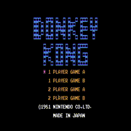

# NES
NES Emulation Software

  

## Features
* 6502 CPU Emulation
* PPU Rendering
* Keyboard Input
* Configurable JSON Key Mapping
* iNES ROM Format Support

## Supported Mappers
* NROM

## Dependencies
* [JSON for Modern C++](https://json.nlohmann.me/)
* [SDL2](https://www.libsdl.org/)
* [spdlog](https://github.com/gabime/spdlog)

## References
* [NESdev Wiki](https://www.nesdev.org/wiki/Nesdev_Wiki)