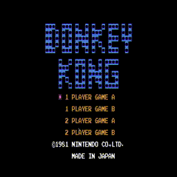

# Marius
Marius ([ˈmäriʊs̠], the Latin root of the Italian name "Mario") is a tiny emulator of NES (Nintendo Entertainment System). It illustrates the fundamental workings of NES by emulating its core components through straightforward algorithms. It also supports various configuration options, debug utilities and a range of common catridge mappers. Moreover, it can be run directly in modern browsers thanks to the powerful WebAssembly technology.

  

### Key Mappings
| Button | Controller 1 | Controller 2 |
|--------|--------------|--------------|
|   A    |      J       |      X       |
|   B    |      K       |      Z       |
| SELECT |    RSHIFT    |    LSHIFT    |
| START  |    ENTER     |     TAB      |
|   ←    |      A       |      ←       |
|   ↑    |      W       |      ↑       |
|   →    |      D       |      →       |
|   ↓    |      S       |      ↓       |

The log of executed 6502 instructions is dumped when F1 is pressed, and the game console states are reset upon pressing F2.

## Build Instructions
To build Marius, the following libraries are required (you can install them using the package manager of your operating system):
* [SDL2](https://www.libsdl.org/)
* [JSON for Modern C++](https://json.nlohmann.me/)
* [spdlog](https://github.com/gabime/spdlog)

After the dependencies listed above are all installed, run the following instructions to build Marius:
```sh
mkdir build && cd build
cmake -DCMAKE_BUILD_TYPE=Release ..
cmake --build .
```

The compiled binary can then be found in the directory `build/marius`. The path to the ROM file that is to be emulated should be provided as the first command line argument.

### WebAssembly
It is possible to compile Marius to WebAssembly using the Emscripten compiler. By default, it emulates the famous "Super Mario Bros." game on a blank web page. However, due to license limitations, its ROM file should be placed in `marius/res` and renamed as `mario.nes` manually.

Run the following instructions to compile the WASM version of Marius. Note that the required files such as `index.html` will be copied to the build directory automatically. Also, ensure that the dependencies are compiled and installed using the same instructions.
```sh
mkdir build && cd build
emcmake cmake -DCMAKE_BUILD_TYPE=Release ..
make
```

## References
* [NESdev Wiki](https://www.nesdev.org/wiki/Nesdev_Wiki)
* [An Overview of NES Rendering](https://austinmorlan.com/posts/nes_rendering_overview/)
